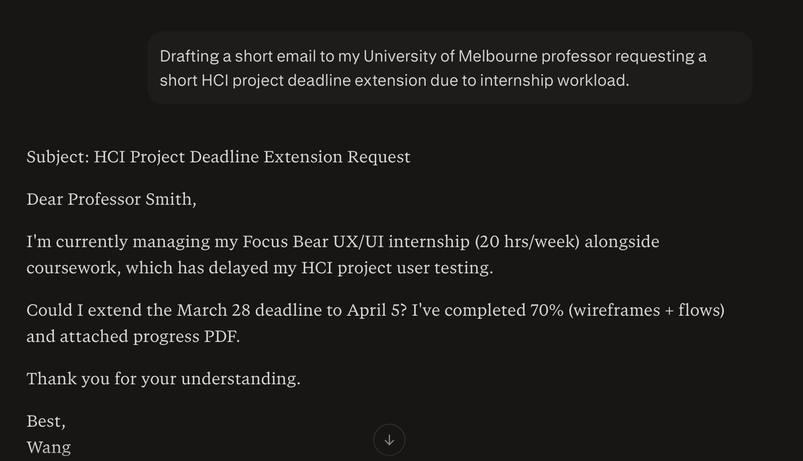

# Use of AI Tools

## What AI tools are typically used for your role?
For QA, common Ai tools include:
ChatGPT, Perplexity, grammarly

## What are the benefits and risks of using AI in a professional setting?
AI boosts efficiency but introduces errors if unchecked.
| Aspect      | Benefits                        | Risks                                                       |
| ----------- | ------------------------------- | ----------------------------------------------------------- |
| Speed/Scale | Drafts reports 5x faster        | Hallucinations (false facts), bias                          |
| Creativity  | New test ideas via prompts      | Data leaks, privacy breaches (GDPR fines)                   |
| Accuracy    | Pattern spotting in logs        | Over-reliance erodes skills                                 |

## What types of information should never be entered into AI tools?
Never input:
PII (names, emails, IDs).
Confidential data.
API keys, source code, financials.

## How can you fact-check and validate AI-generated content to ensure accuracy?
1.Cross-verify claims with docs/devices.
2.Check sources or citations; search Google Scholar for stats.
3.Test plausibility—flag odd claims.
4.Re-run prompt variations; human oracle review.

## When should you use AI for assistance, and when should you rely on your own skills?
AI should only be used as a support tool, such as brainstorming ideas, improving grammar, or exporing different perspective quickly, but not a replacement for thinking. It should be rely on our own skills when making final decisions, working with confidential data, and verifying accuracy.

## How can you avoid over-reliance on AI while still benefiting from it?
To avoid over-reliance, I always try to solve the task myself first and see AI output as draft, not final answers. Also always reflect on why AI's answer works, not just copy it.

## What steps will you take to ensure data privacy when using AI tools?
I always avoid entering confidential information and be cautious about uploading files or documents. 

## Identify one task you can improve using an AI tool, and try it out.
Task: Drafting a short email to my University of Melbourne professor requesting a short HCI project deadline extension due to internship workload.
Tool used: perplexity
output:
Subject: HCI Project Deadline Extension Request
Dear Professor [],
I'm currently managing my Focus Bear UX/UI internship (20 hrs/week) alongside coursework, which has delayed my HCI project user testing.
Could I extend the March 28 deadline to April 5? I've completed 70% (wireframes + flows) and attached progress PDF.
Thank you for your understanding.

Best,
Wang

## Review the AI-generated output critically—did it require editing or fact-checking?
Yes, needed editing and fact-checking.
1.my role in the internship is usability tester, not UI/UX.
2.Verified March 28 deadline via LMS portal.
3.Included Student ID

## Document one best practice you will follow when using AI tools at Focus Bear.
Always review and verify AI-generated content before using it.

