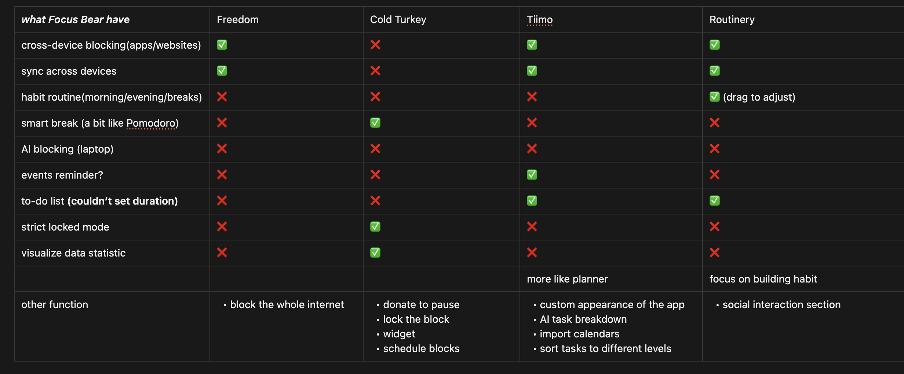

# Competitive Landscape

## What makes Focus Bear different from these apps?
- Particularly designed for neurodivergent indivisuals
- comprehensive system combines blocking, routines, focus session, events reminder, and to-do list, so I don't need to switch between multiple apps. 

## If you were a user, why would you choose Focus Bear over competitors?
- can sync and block across devices.
- my main need is to stay focused and reduce distractions, Focus Bear have the most comprehensive functions for this. Other apps are either not as functional(Freedom, Coldturkey) or mainly focus on planning(Tiimo) or building habits(Routinery).

## What’s one feature that other apps have that Focus Bear doesn’t?
Visualize the tasks schedule for each day, sorting them into morning, afternoon, evening, and anytime sessions.   
Users can clearly see what should be done that day. 

## Based on your research, what’s one improvement you think Focus Bear could make?
Make the UIUX less complex or more intuitive, and sync the design across both mobile and website app to reduce the learning curve.
for instance, user could choose which task to work on from the to-do list in the "Start Focus Session" using the web app, while the mobile app doesn't have this feature.
After doing the competitor analysis, I feel lioke Focus Bear has the most comprehensive functions but lacks an intuitive and authetic user interface to attract and retain users before they discover how good Focus Bear is.