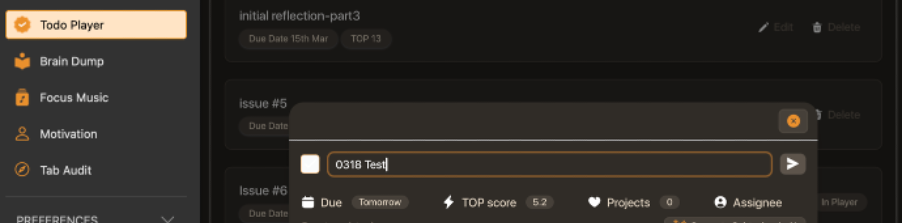
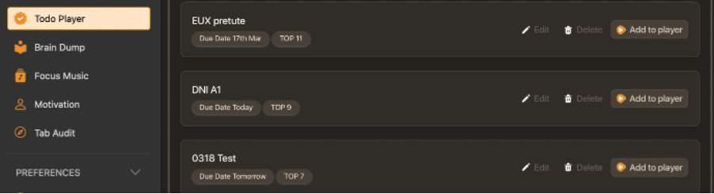
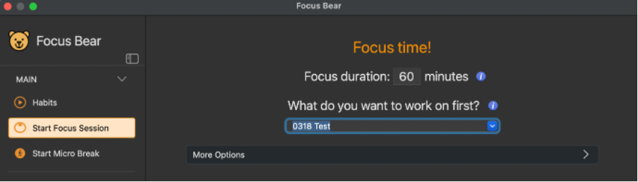
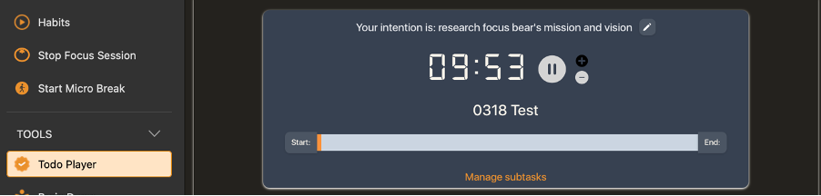
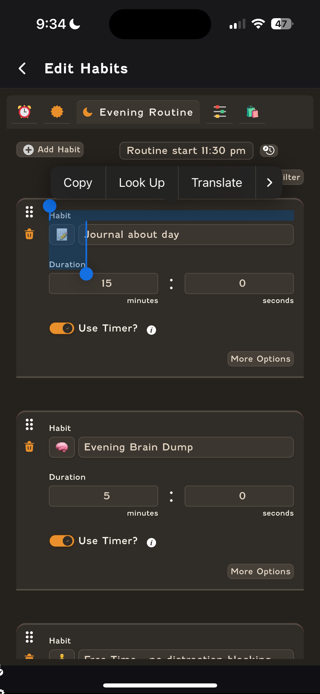
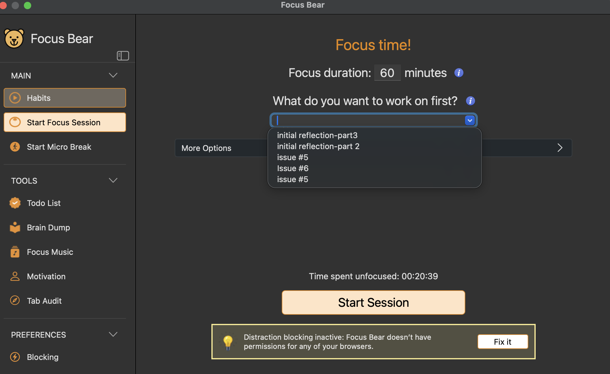
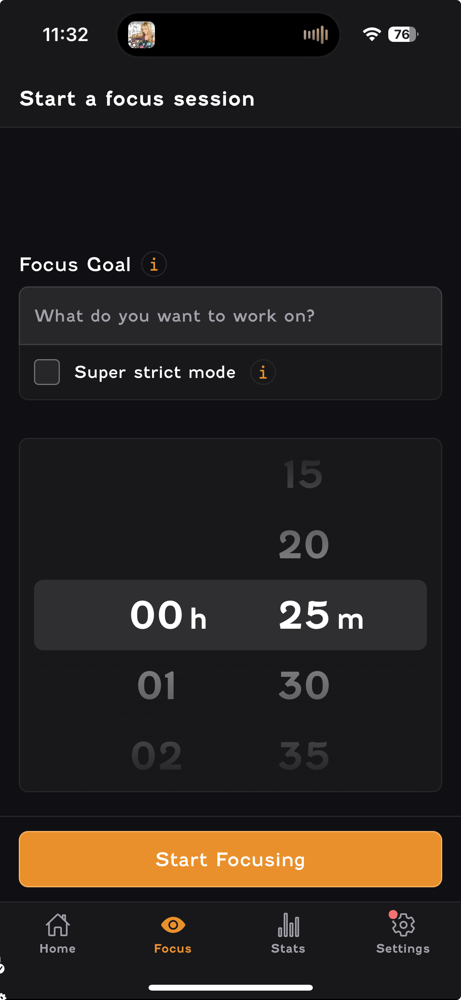
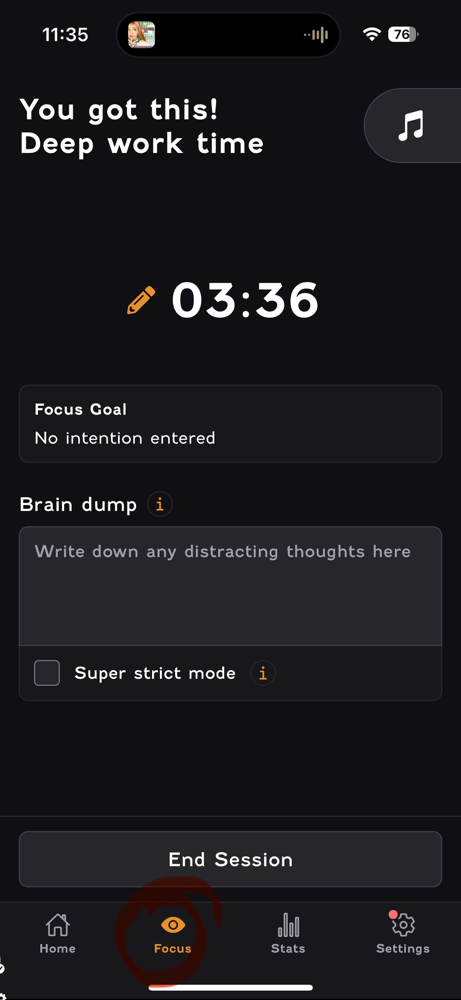
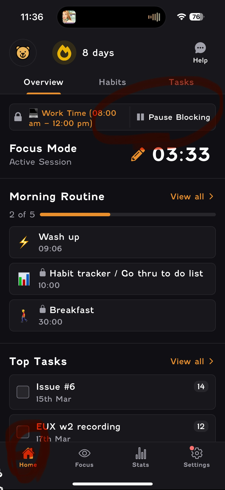
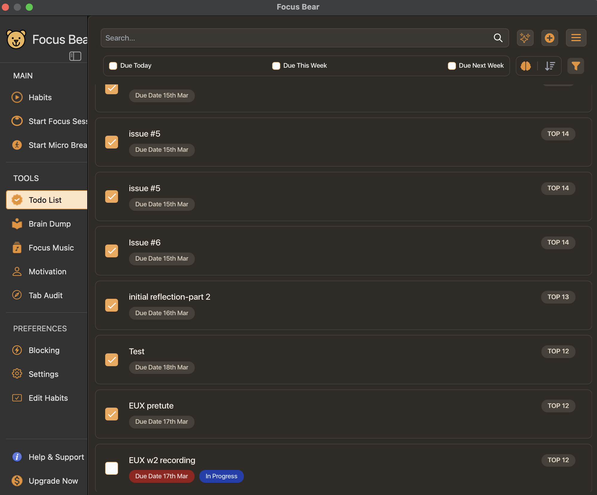

# Improvement Ideas

## 1.[Confusing] Time duration setting in Focus session is not correct.  
Device: Mac  

Step1. Add task in to-do list.  

Step2. To the "Start Focus Session", edit the focus duration to 60 mins and choose the task from the dropdown list.
Step3. click "Start Session"   

Step4. the page shows the wrong task countdown duration.

## 2.[Frustrating] Hard to adjust the order of habit cards.
Device: IOS  

I felt frustrated when trying to adjust the order of my habit routine by holding the six-dot icon on the top left.   
When I try to drag a habit card, it often selects the text instead of moving the card.
  

## 3.[Confusing]The function and layout of Focus session are not consistant.  
Device: Mac/IOS

"Start focus session" on laptop:  
Users are able to choose which task to work on from the dropdown list.

"Start focus session" on mobile app:  
Users can only type down their goal manually during the focus session.  

## 4.[Confusing]When a focus session starts, the pause/resume blocking is not on the Focus page, not intuitive. 
Device: IOS  

session countdown time shows on the focus page:  

while the user has to switch to home page to find the pause/resume blocking button, cause confusing:  

## 5.[Frustrating]Tasks that have been done still shows on the top of To-Do list, cause unconvenient for user to look for the undo tasks.  
Device: Mac  

